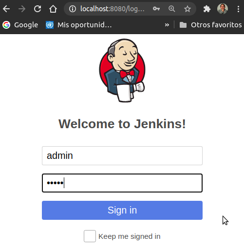
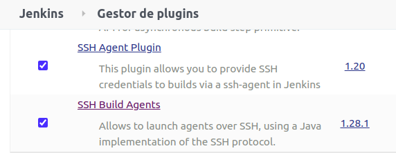
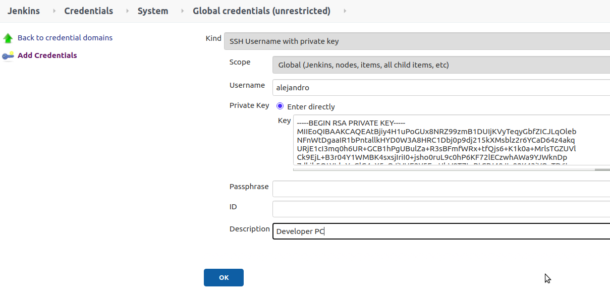
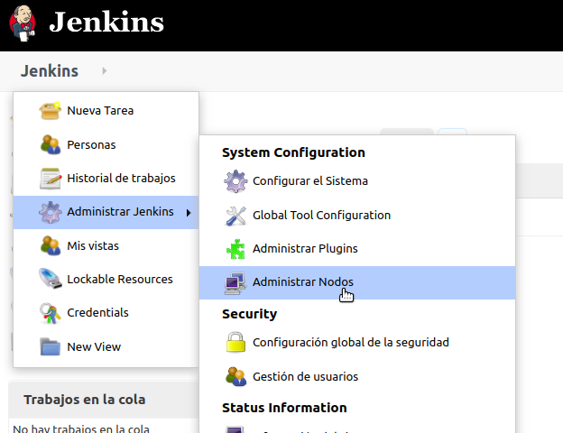
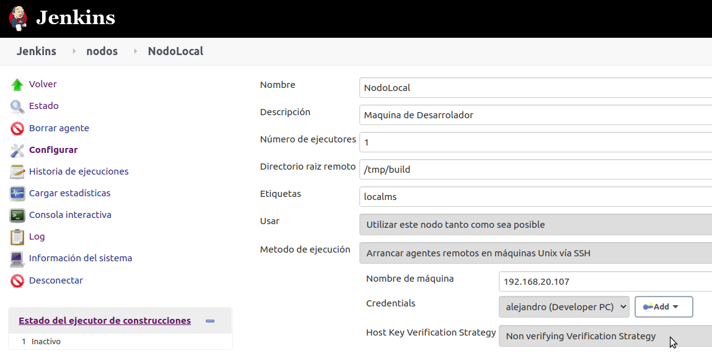

# Minikube con Kafka y Trifecta desde Jenkins

En la siguiente configuración usaremos un Jenkis local (desde docker) al cual le podremos configurar dos tipos de agente

1. Agente por SSH
2. Agente Cloud Docker

**Nota:** Esta configuración no debe ser usada en un ambiente productivo ni accesible en línea. Esta pensada para un ambiente de pruebas controlado.

Para este proceso necesitaras lo siguiente:

1. Llaves publica y privada ya generadas
2. Minikube instalado en el nodo a usar como agente (NodoLocal)
3. Docker instalado en el nodo a usar por le API

## Iniciando docker como imagen con su directorio

```
docker run -p 8080:8080 -p 50000:50000 -v jenkins_home:/var/jenkins_home jenkins/jenkins:lts
```


### Instalando Llaves de manera local

Lo primero es conocer la IP de tu máquina.

Luego copiar el public_id al mismo host

```
ssh-copy-id -i .ssh/id_rsa.pub alejandro@192.168.20.107
```

Luego prueba el ingreso enviando la llave privada para no solicitar clave

```
ssh -i .ssh/id_rsa alejandro@192.168.20.107
```

### Adicionando Credenciales y Nodo por SSH a Jenkins

Antes de adicionar el agente es necesario instalar los plugins de SSH en Jekins para ello vamos
al menu de instalación:


acto seguido seleccionamos las aplicaciones que quermos instalar.



Luego se debe adicionar la llave privada en las credenciales de Jenkins



Luego de esto no vamos a la configuración de los nodos, para adicionar el nodo local.



Por último Creamos el Nodo local.



## Configurando el API de Docker en Ubuntu 18.04

El archivo daemon.json del cual se encuentra un sinfin de documentación ya no suelte tener el mismo efecto en esta versión de ubuntu

Ahora para configurar el **Socket del API** en el puerot 2375 se debe modificar el siguiente archivo: /etc/systemd/system/sockets.target.wants/docker.socket adicionando otro **ListenStream** con el puerto deseado.

```
[Unit]
Description=Docker Socket for the API
PartOf=docker.service

[Socket]
ListenStream=/var/run/docker.sock
ListenStream=2375
SocketMode=0660
SocketUser=root
SocketGroup=docker

[Install]
WantedBy=sockets.target
```

Una vez configurado se debe Habiliar el puerto y reiniciar el servicio de docker

```
systemctl enable docker.socket
systemctl resstart docker.service
```

Para probar que API esta habilitado use de forma local:

```bash
curl -X GET http://localhost:2375/media/json
```
El anterior comando te arroja un listado de las imágenes disponibles en la máquina.

## Corriendo un Projecto que Inicia el Minikube
## Referencias

[Configuración de puerto API](https://riptutorial.com/es/docker/example/15951/habilitar-el-acceso-remoto-a-la-api-de-docker-en-linux-ejecutando-systemd)
[Instalacion Agente SSH](https://plugins.jenkins.io/ssh-agent/)
